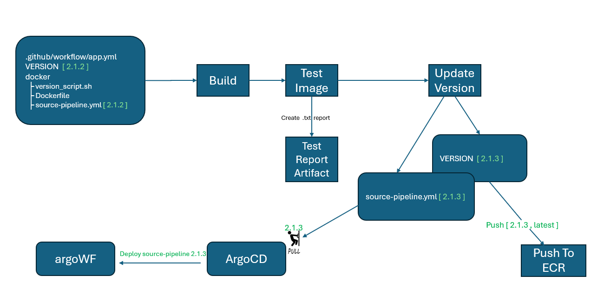

# cgs-xcite-ecr

## Architecture Diagram - subject to progressive changes 




## Create an ECR Repo: 
- xcite-worker
- xcite-cpu_tasks
- xcite-gpu_tasks
- xcite-osm-osmosis

## Add the following as secrets: 

- AWS_ACCESS_KEY_ID
- AWS_ACCOUNT_NUMBER
- AWS_REGION
- AWS_SECRET_ACCESS_KEY


## Run image

```sh
aws ecr describe-repositories
aws ecr list-images --repository-name xcite-worker
aws ecr list-images --repository-name xcite-cpu_tasks
aws ecr list-images --repository-name xcite-gpu_tasks
aws ecr list-images --repository-name xcite-osm-osmosis

aws ecr get-login-password --region us-east-1 | docker login --username AWS --password-stdin <your-account-number>.dkr.ecr.us-east-1.amazonaws.com

docker pull <your-account-number>.dkr.ecr.us-east-1.amazonaws.com/xcite-worker:latest

docker run -itdp 8088:8088 <your-account-number>.dkr.ecr.us-east-1.amazonaws.com/xcite-worker:latest
```